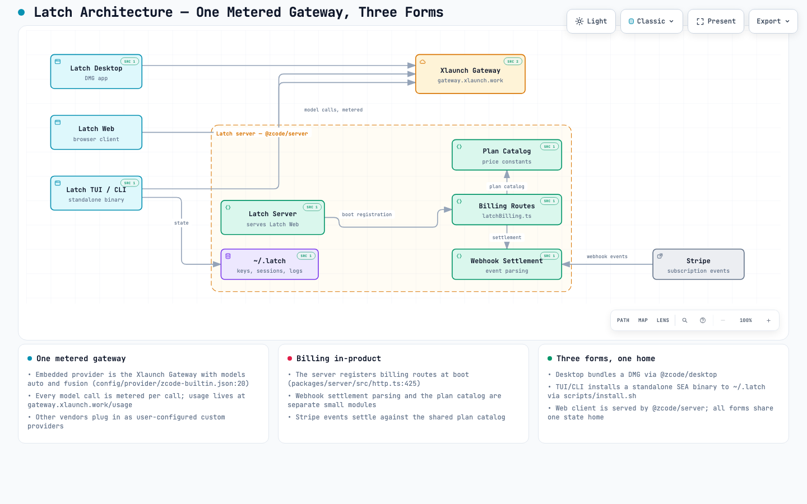

<div align="center">
  
</div>

<p align="center">
  <a href="https://github.com/Northlatch-Labs-LLC/latch"><strong>NORTHLATCH · LATCH</strong></a>
</p>
<p align="center">
  One key, metered per call. Every model call flows through the Northlatch gateway.
</p>
<p align="center">
  <a href="README.md">简体中文</a> | English
</p>

## What is Latch

Latch is the AI coding harness from [Northlatch Labs](https://github.com/Northlatch-Labs-LLC/latch): one coding agent in three shapes — a desktop app, web + server, and a terminal agent (TUI / CLI). This repository contains the clients, the backend services, the shared UI, and the agent CLI and runtime sources.

- **Metered gateway**: every model call flows through the [Xlaunch Gateway](https://gateway.xlaunch.work) with one unified Latch gateway key, metered and priced per call; usage lives at [gateway.xlaunch.work/usage](https://gateway.xlaunch.work/usage).
- **Built-in models**: the gateway ships two built-in models, `auto` and `fusion` (see [config/provider/zcode-builtin.json](config/provider/zcode-builtin.json)); other model vendors can be attached as user-configured custom providers.
- **Sign-in is the key**: the first-party sign-in is the Latch gateway key — no separate vendor accounts required.

## Architecture

Desktop, web, and terminal — three shapes over one metered gateway and one server-side billing stack:

<picture>
  <source media="(prefers-color-scheme: dark)" srcset="docs/latch-architecture.visual-check.1440x900.dark.png">
  
</picture>

Interactive version: [docs/latch-architecture.html](docs/latch-architecture.html). Every key edge is annotated with its repository source evidence (revision f298e08); the composition passed structural validation (9/9, showcase profile) and browser verification (4 viewports, readability).

## Install

### install.sh (terminal)

`scripts/install.sh` installs the product onto this machine (no npm, no registry); it defaults to `~/.latch` and creates the `latch` command in `~/.local/bin`:

```bash
pnpm --dir apps/zcode-cli run build:sea   # build the standalone harness binary first
scripts/install.sh
latch --help
```

The script requires the SEA binary to be built first; `--uninstall` removes the install, and `LATCH_INSTALL_HOME` / `PREFIX` relocate it. See [scripts/install.sh](scripts/install.sh).

### macOS DMG (desktop app)

```bash
pnpm bundle:desktop
```

Artifacts land in `packages/desktop/dist/` (macOS arm64 by default; pick a target with `--os` / `--arch`). Open `Latch-<version>-mac-<arch>.dmg` and drag Latch into Applications. Local builds are unsigned; if macOS blocks the first launch, run:

```bash
sudo xattr -rd com.apple.quarantine /Applications/Latch.app
```

### From source

Prepare Git, Node.js **24.14.0**, and pnpm **10.33.2** (versions per [mise.toml](mise.toml)), then run from the repository root:

```bash
pnpm install
pnpm typecheck
pnpm test:product
```

## Data home

The Latch data home is `~/.latch`: gateway key, sessions, configuration, and logs all live there. The terminal installer accepts `LATCH_INSTALL_HOME` to relocate the install (see [scripts/install.sh](scripts/install.sh)).

## Gateway usage

Every shape shares the same gateway key and the same metering ledger. Usage, cost, and quota live at [gateway.xlaunch.work/usage](https://gateway.xlaunch.work/usage); the in-app "Upgrade" entry points there too.

## Fork provenance

Latch is the productized fork maintained by [Northlatch Labs](https://github.com/Northlatch-Labs-LLC/latch), based on upstream [zai-org/ZCode](https://github.com/zai-org/ZCode) v3.14.3, licensed under the **Apache License 2.0** with modifications (see [LICENSE](LICENSE)). The upstream project's own notices are preserved unmodified in [NOTICE.md](NOTICE.md), this fork's derivation and responsible party are recorded in [NOTICE](NOTICE), and third-party component notices live in [THIRD-PARTY-NOTICES.md](THIRD-PARTY-NOTICES.md).
